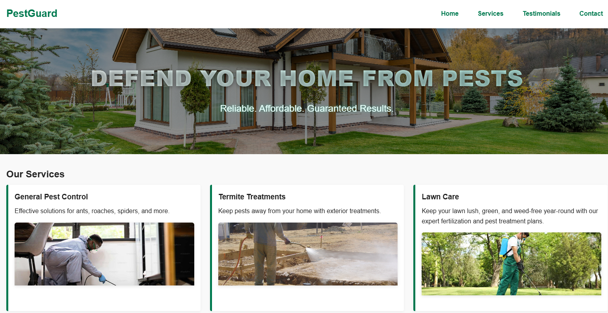
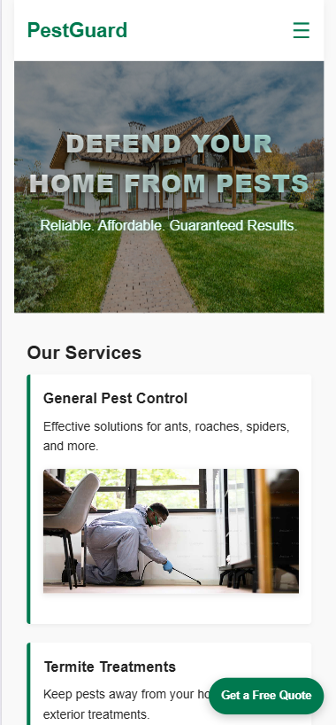

# PestGuard – Pest Control Website

🔗 **Live Demo:** https://codebreaker8609.github.io/PestGuard-layout/

Responsive pest control business website built with semantic HTML, modern CSS, and vanilla JavaScript.  
Designed with a mobile-first approach, SEO-friendly structure, and interactive UI elements to simulate a real-world service website.

---

## ✨ Features

- Mobile-first, fully responsive layout  
- SEO-focused semantic HTML structure and meta tags  
- Interactive testimonial carousel with smooth transitions  
- Contact form integrated with Netlify Forms (no backend required)  
- Service cards with images and hover effects  
- Sticky navigation with animated hamburger menu on mobile  
- Accessible UI with keyboard-friendly controls and proper color contrast  

---

## 🛠️ Tech Stack

- **HTML5** (semantic markup)  
- **CSS3** (Flexbox, Grid, transitions)  
- **JavaScript** (DOM manipulation & event listeners)  
- **Netlify Forms** (contact form handling)

---

## 🖼️ Screenshots

### Desktop View


### Mobile View


---

## 🚀 Local Preview

To run locally:

```bash
git clone https://github.com/CodeBreaker8609/PestGuard-layout.git


